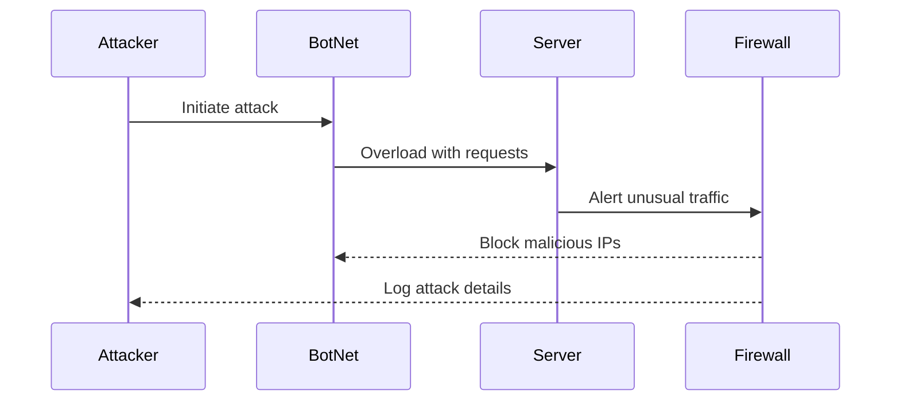

### Description of attack

1. **Attacker to botnet:**
   - The attacker sends a command to the botnet to begin the attack.

2. **BotNet to server:**
   - The botnet floods the server with excessive requests to overwhelm it.

3. **Server to firewall:**
   - The server detects abnormal traffic and alerts the firewall.

4. **Firewall to botnet:**
   - The firewall blocks IPs identified as sources of malicious traffic.

5. **Firewall to attacker:**
   - The firewall logs the attack details for further analysis.
